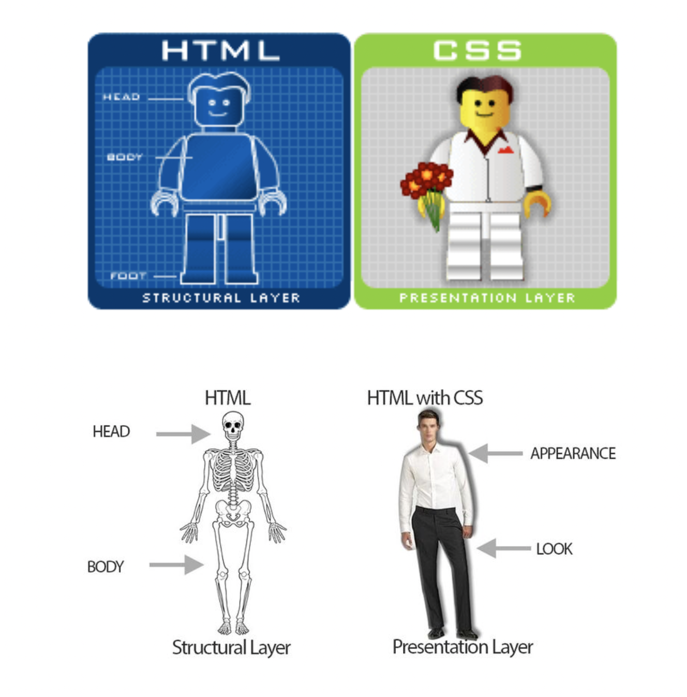
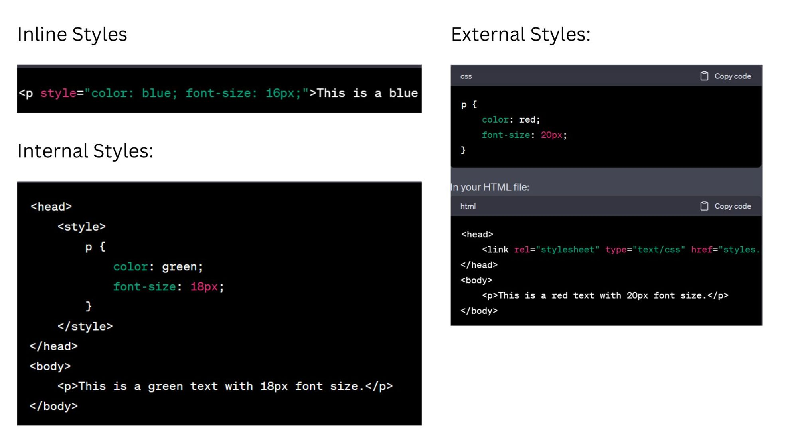
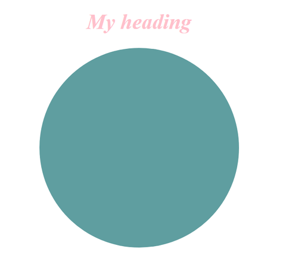
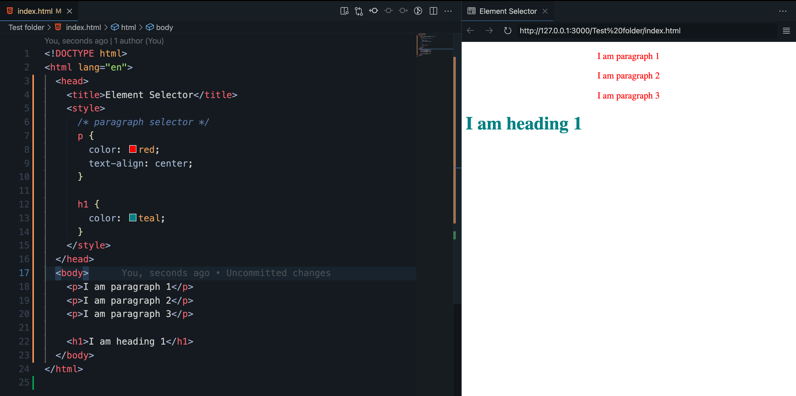
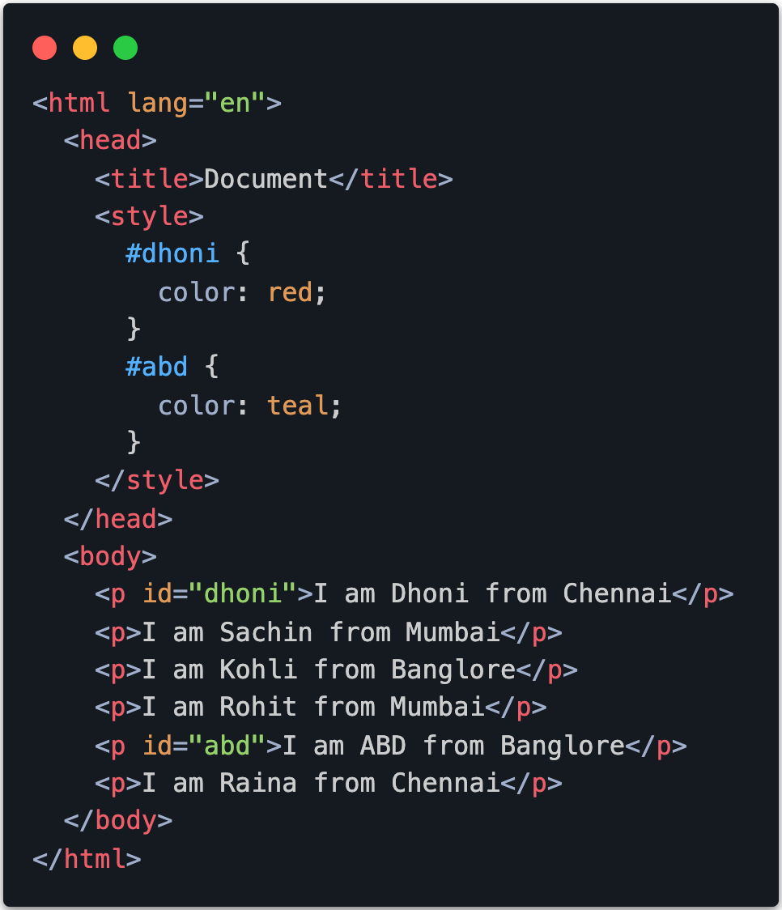
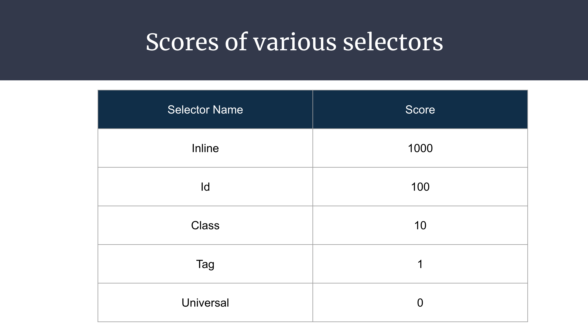
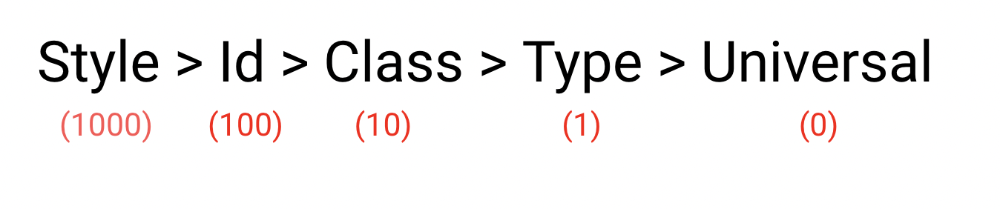
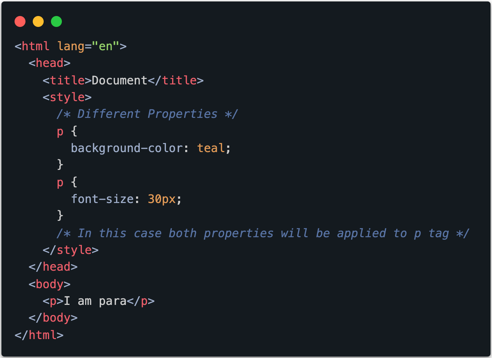
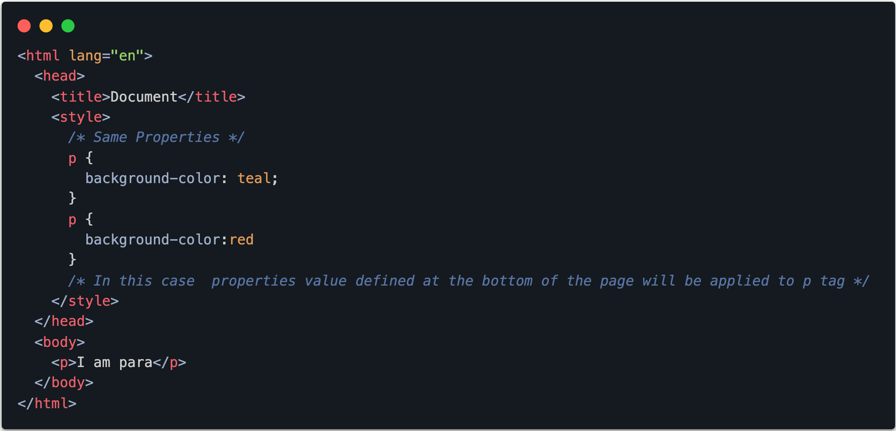

# Introduction to CSS:

## Sample Lecture Link
https://experience-admin.masaischool.com/lectures/detail/?id=74308
- 

## Introduction

- CSS (Cascading Style Sheets) is a styling language used to control the presentation and layout of HTML documents on the web. 

## Detailed Explanation

- **What is the concept?** - 
CSS (Cascading Style Sheets) is a styling language used to control the presentation and layout of HTML documents on the web. It allows web developers to define the appearance of elements such as text, colors, fonts, spacing, and positioning. By separating the content (HTML) from its presentation (CSS), developers can create visually appealing and responsive websites. CSS works by selecting HTML elements and applying styles to them using rulesets defined in a stylesheet. These styles can be specified inline within HTML, embedded within a webpage, or linked externally to multiple web pages for consistent styling across a website.





**Why is it useful?** - 
- **Separation of Concerns**: CSS allows developers to separate the content (HTML) of a web page from its presentation (styling). This separation makes it easier to maintain and update websites, as changes to the styling can be made without altering the underlying HTML structure. It also promotes cleaner and more organized code, improving readability and scalability.

- **Consistency**: CSS enables developers to create consistent styling across multiple pages of a website or even across different websites. By defining styling rules in a centralized style sheet, developers can ensure uniformity in design elements such as colors, fonts, spacing, and layout. Consistent styling enhances the user experience by providing a cohesive and harmonious visual presentation.

- **Flexibility**: CSS provides developers with a wide range of styling options and techniques, allowing them to create diverse and visually appealing designs. From basic text formatting to complex layouts and animations, CSS empowers developers to bring their creative visions to life on the web. It enables customization and personalization, catering to various design preferences and branding requirements.

- **Accessibility**: CSS plays a crucial role in making web content accessible to all users, including those with disabilities. By using CSS to control the presentation of content, developers can optimize readability, enhance navigation, and improve the overall usability of websites. CSS features such as responsive design and media queries enable developers to create accessible and user-friendly experiences across different devices and screen sizes.

- **Efficiency**: With CSS, developers can apply styling rules globally or selectively target specific elements or groups of elements within an HTML document. This allows for efficient styling updates and modifications, reducing the need for repetitive coding and saving development time. CSS preprocessors such as Sass and LESS further enhance efficiency by offering advanced features such as variables, mixins, and functions.

**Real-world examples or analogies** - 
- **Fashion Design**: Just as fashion designers use different fabrics, colors, patterns, and styles to create unique clothing designs, web developers use CSS to style and design the visual appearance of websites. CSS serves as the "wardrobe" of a website, allowing developers to customize the look and feel of web pages to reflect the brand identity, user preferences, and design trends.

- **Interior Decorating**: Similar to how interior decorators use furniture, colors, textures, and lighting to create inviting and aesthetically pleasing living spaces, CSS is used to enhance the visual appeal and usability of web pages. CSS stylesheets act as the "decorative elements" of a website, adding visual interest, organization, and coherence to the layout and presentation of content.

- **Artistic Painting**: Just as painters use different brush strokes, colors, and techniques to create captivating works of art, web developers use CSS to apply styles, colors, fonts, and effects to HTML elements. CSS allows developers to express their creativity and design skills, transforming plain HTML documents into visually engaging and dynamic web pages that captivate and inspire users.

- **Architecture and Design**: In architecture and design, blueprints and architectural plans provide the structural framework for buildings, while interior design elements such as furniture, lighting, and decorations enhance their aesthetic appeal and functionality. Similarly, HTML serves as the structural foundation of web pages, while CSS provides the styling and layout instructions that shape the visual presentation and user experience.

- **Cooking and Recipe Design**: Just as chefs use ingredients, flavors, textures, and presentation techniques to create delicious and visually appealing dishes, web developers use CSS to design and style the layout, typography, colors, and imagery of websites. CSS allows developers to combine different design elements and visual components to create delightful and engaging user experiences on the web.
- **Visual models** - 
`<!-- Need to Complete this seection Need to attach Images -->`


### How to Add CSS to HTML File

## Detailed Explanation

**What is the concept?** - When adding CSS to an HTML file, developers utilize a method known as "linking" or "embedding" to associate external CSS files or include CSS directly within the HTML document. This process enables developers to apply styling rules defined in CSS to HTML elements, thereby controlling the visual appearance of a webpage.

**Linking External CSS File**:
By linking an external CSS file to an HTML document, developers maintain a clear separation between content and presentation. This method involves using the <link> element within the HTML <head> section to specify the location of the external CSS file. Once linked, the CSS rules defined in the external file are applied to the corresponding HTML elements, allowing for centralized management and easy updates.

**Embedding CSS Directly in HTML**:
Alternatively, developers can embed CSS directly within the HTML document using the `<style>` element within the `<head>` section or by applying inline styles directly to HTML elements using the style attribute. While embedding CSS offers more immediate control over individual elements, it may lead to code duplication and reduced maintainability, especially in larger projects.

**Why is it useful?** 
- Adding CSS to HTML files is essential for creating visually appealing and user-friendly web pages. It offers several benefits and use cases in real-world applications:

- **Enhanced Styling and Presentation**: CSS enables developers to customize the appearance of HTML elements, including fonts, colors, sizes, margins, and more. By adding CSS to HTML files, developers can enhance the visual presentation of web content, making it more attractive and engaging for users.

- **Improved Consistency and Maintainability**: By externalizing CSS rules into separate files and linking them to HTML documents, developers can ensure consistent styling across multiple pages of a website. This approach promotes code reusability, simplifies maintenance, and facilitates updates, as changes to the CSS file automatically propagate to all linked HTML pages.

- **Efficient Development Workflow**: Separating CSS from HTML allows developers to focus on each aspect of web development independently. This separation of concerns promotes a more efficient development workflow, enabling designers to work on styling without directly modifying the HTML structure, and vice versa.

- **Scalability and Reusability**: Linking external CSS files enables developers to create modular, reusable styling components that can be applied across multiple pages or projects. This scalability and reusability contribute to a more robust and maintainable codebase, reducing development time and effort in the long run.
- **Real-world examples or analogies** - Provide examples or analogies to help learners understand the topic better.
-  - If applicable, include diagrams, flowcharts, or other visual aids to enhance understanding.


**Visual models**:-

3 ways of adding CSS to your HTML
- **Inline CSS**
- **Internal CSS**
- **External CSS**




## Instructor Activity | Code Implementation | Examples

1. **Inline CSS**:

```html
<!DOCTYPE html>
<html>
<head>
    <title>Inline CSS Example</title>
</head>
<body>
    <h1 style="color: blue; font-size: 24px;">Welcome to My Website</h1>
    <p style="font-family: Arial, sans-serif; background-color: #f2f2f2;">This is a paragraph with inline CSS styling.</p>
</body>
</html>

```
2. **Internal CSS**
```html
<!DOCTYPE html>
<html>
<head>
    <title>Internal CSS Example</title>
    <style>
        h1 {
            color: blue;
            font-size: 24px;
        }
        p {
            font-family: Arial, sans-serif;
            background-color: #f2f2f2;
        }
    </style>
</head>
<body>
    <h1>Welcome to My Website</h1>
    <p>This is a paragraph with internal CSS styling.</p>
</body>
</html>

```
3. **External CSS**:
External CSS is defined in a separate .css file and linked to the HTML document using the <link> element.

HTML File (index.html):
```html
<!DOCTYPE html>
<html>
<head>
    <title>External CSS Example</title>
    <link rel="stylesheet" type="text/css" href="styles.css">
</head>
<body>
    <h1>Welcome to My Website</h1>
    <p>This is a paragraph with external CSS styling.</p>
</body>
</html>

 ```
CSS File (styles.css):

```html
h1 {
    color: blue;
    font-size: 24px;
}
p {
    font-family: Arial, sans-serif;
    background-color: #f2f2f2;
}

```

In HTML we have tags such as 
```html
<i>Italic</i>
<u>Underline</u>
<b>Bold</b>
<strong>Bold</strong>
```
In CSS they can be written as:
```css
font-size: 30px;
font-weight: bold;
font-style: italic;
text-align: center;
text-decoration:line-through;
text-shadow: #fcde9f;
```

## Student Activities



Try to create above UI.

**Inline CSS Practice**:
- Create a simple HTML document with multiple elements (e.g., headings, paragraphs, divs) and apply inline CSS to style each element differently. Experiment with properties such as color, font size, background color, and text alignment.
- Objective: Practice applying CSS directly to HTML elements using the style attribute and understand how inline CSS overrides external and internal styles.

**Internal CSS Challenge**:
- Modify the provided HTML document by removing all inline styles and applying the same styling using internal CSS within the `<style>` element in the `<head>` section. Ensure that each HTML element retains its original styling.
- Objective: Understand the concept of internal CSS and its application within HTML documents. Practice consolidating styling rules within the document itself for easier maintenance.

**External CSS Integration**:
- Create a new HTML document and link it to an external CSS file (styles.css). Define styling rules for various HTML elements in the CSS file and observe how they affect the appearance of the HTML document.
- Objective: Learn how to link HTML documents to external CSS files and understand the benefits of separating content and presentation. Practice defining and managing styling rules in a separate CSS file.


## Conclusion

- CSS helps to improve the user experience by improving the aesthetics of your app.

## Resources

- https://developer.mozilla.org/en-US/docs/Web/CSS
- https://developer.mozilla.org/en-US/docs/Web/CSS/CSS_syntax


# Types of CSS color values

## Introduction
Understanding CSS color values is crucial in web development as colors play a significant role in defining the visual appeal and aesthetics of a website. CSS provides various methods to specify colors, each with its own syntax and use cases. In this topic, we will explore the different types of CSS color values and how they are applied in styling web elements.

## Introduction
Understanding CSS color values is crucial in web development as colors play a significant role in defining the visual appeal and aesthetics of a website. CSS provides various methods to specify colors, each with its own syntax and use cases. In this topic, we will explore the different types of CSS color values and how they are applied in styling web elements.

## Detailed Explanation
- **What is the concept?**

What are the types of CSS color values?
CSS offers several types of color values, including:

- **Named Colors**: Predefined color names such as "red," "blue," "green," etc., which represent specific colors. These names provide a convenient way to use common colors without specifying their RGB or hexadecimal values.

- **Hexadecimal Colors**: Colors specified using a hexadecimal notation, consisting of a hash symbol followed by three or six hexadecimal digits representing the intensity of red, green, and blue components, respectively. 
For example, `#ff0000` represents red, `#00ff00` represents green, and `#0000ff` represents blue.

- **RGB Colors**: Colors defined using the RGB (Red, Green, Blue) color model, which represents colors as combinations of red, green, and blue components. RGB colors are specified using the rgb() function, where each component is expressed as an integer value between 0 and 255. For example, rgb(255, 0, 0) represents red, rgb(0, 255, 0) represents green, and rgb(0, 0, 255) represents blue.

- **RGBA Colors**: Similar to RGB colors, RGBA colors also use the RGB color model but include an additional alpha channel to specify the opacity of the color. RGBA colors are specified using the rgba() function, where the alpha value is a number between 0 (fully transparent) and 1 (fully opaque). For example, rgba(255, 0, 0, 0.5) represents a semi-transparent red color.

- **HSL Colors**: Colors defined using the HSL (Hue, Saturation, Lightness) color model, which represents colors based on their hue, saturation, and lightness. HSL colors are specified using the hsl() function, where hue is expressed as an angle between 0 and 360 degrees, saturation and lightness are expressed as percentages. For example, hsl(0, 100%, 50%) represents red, hsl(120, 100%, 50%) represents green, and hsl(240, 100%, 50%) represents blue.

- **HSLA Colors**: Similar to HSL colors, HSLA colors also include an alpha channel to specify opacity. HSLA colors are specified using the hsla() function, where the alpha value is a number between 0 (fully transparent) and 1 (fully opaque). For example, hsla(0, 100%, 50%, 0.5) represents a semi-transparent red color.

**Why are they useful?**

Each type of CSS color value offers unique advantages and use cases:

- **Named Colors**: Provide convenience for using common colors without memorizing hexadecimal or RGB values.
- **Hexadecimal Colors**: Offer a wide range of colors with precise control over intensity.
- **RGB Colors**: Allow specifying colors by adjusting red, green, and blue components individually.
- **RGBA Colors**: Provide control over opacity, allowing for the creation of translucent colors and effects.
- **HSL Colors**: Offer a more intuitive way to specify colors based on hue, saturation, and lightness.
- **HSLA Colors**: Combine the benefits of HSL colors with the ability to control opacity.
By understanding and utilizing the various types of CSS color values, developers can effectively style web elements and create visually appealing and engaging web experiences.


## Instructor Activity | Code Implementation | Examples

To illustrate the concept of different CSS color values, the instructor will demonstrate various examples using code snippets:

### Example 1: Using Named Colors
```css
/* Example of using named colors */
p {
    color: red;
    background-color: yellow;
}
```
Explanation:

In this example, the instructor will apply named colors directly to HTML elements using CSS.
The paragraph (`<p>`) elements will have red text color and yellow background color.

### Example 2: Applying Hexadecimal Color Codes
```css
/* Example of using hexadecimal color codes */
h1 {
    color: #336699;
    background-color: #ffcc00;
}
```
Explanation:

This example demonstrates the use of hexadecimal color codes to style HTML elements.
The h1 elements will have a color of dark blue (#336699) and a background color of yellow (#ffcc00).

### Example 3: Specifying RGB and RGBA Color Values

```css
/* Example of using RGB and RGBA color values */
div {
    background-color: rgb(255, 0, 0); /* Red */
    border: 2px solid rgba(0, 128, 0, 0.5); /* Green with 50% opacity */
}
```
Explanation:

The instructor will showcase how to specify colors using RGB and RGBA values.
In this example, a div element will have a solid red background color and a green border with 50% opacity.
Example 4: Defining HSL and HSLA Color Values
```css
/* Example of using HSL and HSLA color values */
span {
    color: hsl(120, 100%, 50%); /* Green */
    background-color: hsla(240, 100%, 50%, 0.7); /* Blue with 70% opacity */
}
```
Explanation:

This example demonstrates the usage of HSL and HSLA color values in CSS.
The span elements will have a green text color and a blue background color with 70% opacity.


## Student Activities

### Color Naming Exercise:

Task: Create an HTML document with multiple <div> elements, each representing a different section of a webpage (e.g., header, navigation, content, footer). Apply different named colors (e.g., "red," "blue," "green," "yellow") to each <div> element using CSS.
Objective: Practice using named colors to style HTML elements and understand how to apply predefined colors in CSS.
### Hexadecimal Color Code Challenge:

Task: Experiment with hexadecimal color codes to create a color palette for a website. Use an online color picker tool to generate hexadecimal color codes for various colors. Apply these hexadecimal color codes to different HTML elements (e.g., headings, paragraphs, links) using CSS.
Objective: Gain familiarity with hexadecimal color codes and understand how to specify custom colors using hexadecimal notation in CSS.

### RGB and RGBA Color Exploration:

Task: Create a simple webpage layout with a header, navigation menu, content section, and footer. Apply RGB and RGBA color values to each section using CSS. Experiment with different RGB color combinations and adjust the alpha (opacity) value for RGBA colors to achieve various visual effects.
Objective: Learn how to specify colors using RGB and RGBA values in CSS and understand the impact of adjusting the opacity on the transparency of colors.

### HSL and HSLA Color Practice:

Task: Design a webpage layout with multiple sections (e.g., header, sidebar, main content, footer) using HTML. Apply HSL and HSLA color values to style each section using CSS. Experiment with different hue, saturation, and lightness values to create a visually appealing color scheme.
Objective: Explore the use of HSL and HSLA color values in CSS and understand how to define colors based on hue, saturation, and lightness parameters. Practice manipulating these parameters to achieve desired color effects.

# CSS Properties and Values

## Introduction

CSS (Cascading Style Sheets) is a powerful language used to style and format the visual presentation of web pages. CSS properties and values play a crucial role in defining the appearance and behavior of HTML elements on a webpage. Understanding the various CSS properties and values is essential for web developers to create attractive and functional designs.

## Detailed Explanation

### **What is the concept?** 
### CSS Properties:

CSS properties are attributes that define the visual characteristics of HTML elements. Each property corresponds to a specific aspect of an element's presentation, such as color, font, size, position, and more. CSS properties can be applied to HTML elements using selectors, enabling developers to customize the appearance of individual elements or groups of elements within a webpage.

**Why is it useful?**:

CSS Property Syntax
The syntax for CSS properties typically consists of a property name followed by a colon (:) and the corresponding value. Multiple properties can be specified within a CSS rule, separated by semicolons (;). For example:

```css
selector {
    property1: value1;
    property2: value2;
    /* Additional properties */
}
```

**Real-world examples or analogies**

CSS properties can be categorized into several groups based on their functionality:

- Box Model Properties: Control the layout and dimensions of elements within the document flow, including properties like width, height, margin, padding, border, and display.

- Typography Properties: Define the appearance of text content, including properties like font-family, font-size, font-weight, text-align, text-decoration, and line-height.

- Color and Background Properties: Specify the color and background properties of elements, including properties like color, background-color, background-image, and opacity.

- Positioning Properties: Determine the positioning of elements within the document flow, including properties like position, top, bottom, left, right, float, and clear.

- Flexbox and Grid Properties: Control the layout and alignment of elements using modern layout techniques like Flexbox and CSS Grid, including properties like display, flex, justify-content, align-items, grid-template-columns, and grid-template-rows.

- CSS Property Values
CSS property values represent the settings or parameters that define the behavior of a particular property. Property values can be expressed in various formats, including keywords, lengths, percentages, colors, URLs, and more. The specific value format depends on the property being used and its intended functionality.

## Instructor Activity | Code Implementation | Examples

### Box Model Demonstration:

```html
<!DOCTYPE html>
<html lang="en">
<head>
    <meta charset="UTF-8">
    <meta name="viewport" content="width=device-width, initial-scale=1.0">
    <title>Box Model Demonstration</title>
    <style>
        .box {
            width: 200px;
            height: 100px;
            margin: 20px;
            padding: 10px;
            border: 2px solid black;
            background-color: lightgray;
        }
    </style>
</head>
<body>
    <div class="box">Content inside the box</div>
</body>
</html>
```
Explanation: This example demonstrates the box model properties (width, height, margin, padding, border) applied to a <div> element with the class "box". Adjusting these properties affects the layout and spacing of the element within the webpage.

### Styling Code Example:
```html
<!DOCTYPE html>
<html lang="en">
<head>
    <meta charset="UTF-8">
    <meta name="viewport" content="width=device-width, initial-scale=1.0">
    <title>Typography Styling Tutorial</title>
    <style>
        body {
            font-family: Arial, sans-serif;
            line-height: 1.5;
        }
        h1 {
            font-size: 24px;
            font-weight: bold;
            text-align: center;
            text-decoration: underline;
        }
        p {
            font-size: 16px;
            text-align: justify;
        }
    </style>
</head>
<body>
    <h1>Welcome to CSS Typography Tutorial</h1>
    <p>This is a paragraph demonstrating the use of typography properties to style text content. Adjust the font size, weight, alignment, and decoration properties to see their effects.</p>
</body>
</html>
```

Explanation: This example showcases typography properties applied to headings and paragraphs. Adjusting properties like font size, weight, alignment, and decoration alters the appearance of the text content.

### Color and Background Exercise:
```html
<!DOCTYPE html>
<html lang="en">
<head>
    <meta charset="UTF-8">
    <meta name="viewport" content="width=device-width, initial-scale=1.0">
    <title>Color and Background Exercise</title>
    <style>
        body {
            background-color: lightblue;
        }
        h1 {
            color: darkblue;
        }
        .container {
            background-color: lightgray;
            padding: 20px;
        }
    </style>
</head>
<body>
    <h1>Color and Background Exercise</h1>
    <div class="container">
        <p>This is a paragraph with a light gray background.</p>
    </div>
</body>
</html>
```
Explanation: This example demonstrates the application of color and background properties to the webpage background, headings, and container element. Adjust the color values to observe changes in the appearance of text and background elements.

### Positioning Techniques Workshop:

```html
<!DOCTYPE html>
<html lang="en">
<head>
    <meta charset="UTF-8">
    <meta name="viewport" content="width=device-width, initial-scale=1.0">
    <title>Positioning Techniques Workshop</title>
    <style>
        .header {
            background-color: lightblue;
            padding: 20px;
            text-align: center;
        }
        .sidebar {
            float: left;
            width: 20%;
            background-color: lightgray;
            padding: 20px;
        }
        .content {
            margin-left: 22%;
            padding: 20px;
        }
        .footer {
            clear: both;
            background-color: lightblue;
            padding: 20px;
            text-align: center;
        }
    </style>
</head>
<body>
    <div class="header">
        <h1>Header</h1>
    </div>
    <div class="sidebar">
        <h2>Sidebar</h2>
        <p>Lorem ipsum dolor sit amet, consectetur adipiscing elit.</p>
    </div>
    <div class="content">
        <h2>Content</h2>
        <p>Lorem ipsum dolor sit amet, consectetur adipiscing elit.</p>
    </div>
    <div class="footer">
        <h3>Footer</h3>
    </div>
</body>
</html>
```
Explanation: This example showcases positioning techniques using CSS properties like float and margin. The layout includes a header, sidebar, content, and footer sections positioned using different CSS properties.

## Conclusion
Understanding the different types of CSS color values is essential for web developers as it enables them to effectively utilize colors in styling web elements. Whether using named colors for simplicity or leveraging RGBA colors for transparency effects, the choice of color value type depends on the specific design requirements and desired visual effects.

Resources:

[CSS properties - MDN Web Docs](https://developer.mozilla.org/en-US/docs/Web/CSS/Using_CSS_custom_properties)

[CSS Colors- MDN Web Docs](https://developer.mozilla.org/en-US/docs/Web/API/Canvas_API/Tutorial/Applying_styles_and_colors)


# CSS Selectors

## Introduction
CSS selectors are fundamental components of Cascading Style Sheets (CSS) that allow developers to target specific HTML elements and apply styling rules to them. Understanding CSS selectors is crucial for creating well-structured and visually appealing web pages.

## Detailed Explanation

**What is the concept?**

CSS selectors are patterns used to select and style HTML elements based on their attributes, types, classes, or relationships with other elements in the document. They define the scope of CSS rules and determine which elements the rules should apply to.

## Types of Selectors

There are various types of selectors in CSS. They are:

1. **CSS Element / tag Selector**
2. **CSS Id Selector**
3. **CSS Class Selector**
4. **CSS Universal Selector**

## **CSS Element or tag Selector**

- The element selectors select the HTML elements by its tag name.



- All the `<p>` elements will be center-aligned and all h1’s will get teal color

```html
<!DOCTYPE html>
<html lang="en">
  <head>
    <title>Element Selector</title>
    <style>
      /* paragraph selector */
      p {
        color: red;
        text-align: center;
      }

      h1 {
        color: teal;
      }
    </style>
  </head>
  <body>
    <p>I am paragraph 1</p>
    <p>I am paragraph 2</p>
    <p>I am paragraph 3</p>

    <h1>I am heading 1</h1>
  </body>
</html>

```

## CSS ID Selector

### Instructor Task:

- **Explaining the analogy of an IPL team.**
- In a team, there are so many players
- When you want to point out or select one player.
- In this case, you will call out his jersey number/ name to pick up.
- This is similar to an id selector where we pick up a tag based on a particular id name
```html
<!DOCTYPE html>
<html lang="en">
  <head>
    <meta charset="UTF-8" />
    <meta http-equiv="X-UA-Compatible" content="IE=edge" />
    <meta name="viewport" content="width=device-width, initial-scale=1.0" />
    <title>Document</title>
    <style>
      #dhoni{
        color:red
      }
      #abd{
        color:teal
      }
    </style>

  </head>
  <body>
    <p id="dhoni">I am Dhoni from Chennai</p>
    <p>I am Sachin from Mumbai</p>
    <p>I am Kohli from Banglore</p>
    <p>I am Rohit from Mumbai</p>
    <p id="abd">I am ABD from Banglore</p>
    <p>I am Raina from Chennai</p>
  </body>
</html>

```
- In the above example, we want to select dhoni, we have to use the ID selector


- An ID selector is declared using a hash, or pound symbol (`#`) preceding a string of characters.
- This selector matches any HTML element that has an ID attribute with the same value as that of the selector.
- Here’s an example:



```html
<!DOCTYPE html>
<html lang="en">
  <head>
    <meta charset="UTF-8" />
    <meta http-equiv="X-UA-Compatible" content="IE=edge" />
    <meta name="viewport" content="width=device-width, initial-scale=1.0" />
    <title>Document</title>
    <style>
      #dhoni{
        color:red
      }
      #abd{
        color:teal
      }
    </style>

  </head>
  <body>
    <p id="dhoni">I am Dhoni from Chennai</p>
    <p>I am Sachin from Mumbai</p>
    <p>I am Kohli from Banglore</p>
    <p>I am Rohit from Mumbai</p>
    <p id="abd">I am ABD from Banglore</p>
    <p>I am Raina from Chennai</p>
  </body>
</html>

```

## CSS Class selector:

- Now you want to select a group of players based on their team name eg,(CSK,MI,RCB)
- In this case we can will call out by using class selector, so all players with particular class  will be selected

```html
<!DOCTYPE html>
<html lang="en">
  <head>
    <meta charset="UTF-8" />
    <meta http-equiv="X-UA-Compatible" content="IE=edge" />
    <meta name="viewport" content="width=device-width, initial-scale=1.0" />
    <title>Document</title>
    <style>
      .csk{
        background-color:yellow
      }

      .rcb{
        background-color:rgb(182, 65, 65)
      }
    </style>

  </head>
  <body>
    <p class="csk" id="dhoni">I am Dhoni from Chennai</p>
    <p class="mi">I am Sachin from Mumbai</p>
    <p class="rcb">I am Kohli from Banglore</p>
    <p class="mi">I am Rohit from Mumbai</p>
    <p class="rcb" id="abd">I am ABD from Banglore</p>
    <p class="csk">I am Raina from Chennai</p>
  </body>
</html>

```

```jsx
<!DOCTYPE html>
<html lang="en">
  <head>
    <style>
      .csk{
        background-color:yellow
      }

      .rcb{
        background-color:rgb(182, 65, 65)
      }
    </style>

  </head>
  <body>
    <p class="csk" id="dhoni">I am Dhoni from Chennai</p>
    <p class="mi">I am Sachin from Mumbai</p>
    <p class="rcb">I am Kohli from Banglore</p>
    <p class="mi">I am Rohit from Mumbai</p>
    <p class="rcb" id="abd">I am ABD from Banglore</p>
    <p class="csk">I am Raina from Chennai</p>
  </body>
</html>
```

- In the above example we are selecting rcb team members


## Universal selectors:

- Now you wants to select all teams at once, in this case we will use universal selector
```html
<!DOCTYPE html>
<html lang="en">
  <head>
    <meta charset="UTF-8" />
    <meta http-equiv="X-UA-Compatible" content="IE=edge" />
    <meta name="viewport" content="width=device-width, initial-scale=1.0" />
    <title>Document</title>
    <style>
      *{
        font-size:40px
      }
    </style>

  </head>
  <body>
    <p class="csk" id="dhoni">I am Dhoni from Chennai</p>
    <p class="mi">I am Sachin from Mumbai</p>
    <p class="rcb">I am Kohli from Banglore</p>
    <p class="mi">I am Rohit from Mumbai</p>
    <p class="rcb" id="abd">I am ABD from Banglore</p>
    <p class="csk">I am Raina from Chennai</p>
  </body>
</html>

```


## Now, let’s look at an example, let’s create a single p tag with different properties.

```jsx
<html lang="en">
  <head>
    <style>
      * {
        font-size: 60px;
        color: teal;
        font-style: italic;
        font-weight: bold;
        text-align: center;
      }

      p {
        color: red;
      }

      .online {
        font-size: 100px;
        color: rgb(146, 146, 39);
      }

      #school {
        font-style: normal;
        font-size: 150px;
        color: green;
      }
    </style>
  </head>
  <body>
    <p id="school" class="online" style="color: pink">Masai School</p>
  </body>
</html>
```

## Priority of Selectors





- Follow this order **SICTU**
    - S - inline style
    - I  - Id selector
    - C - Class selector
    - T - Type/Tag selector
    - U - Universal selector
- [Codepen](https://codepen.io/vchandu111/pen/abEwZVQ)

## Same Selectors Multiple Definitions:

- **Different Properties** - All the different properties are applied to the elements

```html
<!DOCTYPE html>
<html lang="en">
  <head>
    <meta charset="UTF-8" />
    <meta http-equiv="X-UA-Compatible" content="IE=edge" />
    <meta name="viewport" content="width=device-width, initial-scale=1.0" />
    <title>Document</title>
    <style>
      * {
        font-size: 60px;
        color: teal;
        font-style: italic;
        font-weight: bold;
        text-align: center;
      }

      p {
        color: red;
      }

      .online {
        font-size: 100px;
        color: rgb(146, 146, 39);
      }

      #school {
        font-style: normal;
        font-size: 150px;
        color: green;
      }
    </style>
  </head>
  <body>
    <p id="school" class="online" style="color: pink">Masai School</p>
  </body>
</html>

<!-- Style (inline styles)
ID Selector 
Class Selector 
Type Selector 
Universal Selector -->

```
    

    

- **Live code**: 

```html
<html lang="en">
  <head>
    <title>Document</title>
    <style>
      /* Different Properties */
      p {
        background-color: teal;
      }
      p {
        font-size: 30px;
      }
      /* In this case both properties will be applied to p tag */
    </style>
  </head>
  <body>
    <p>I am para</p>
  </body>
</html>
```
- **Same Properties** - Properties Values Defined at the bottom are applied to the elements



- **Live Code**:
```html
<html lang="en">
  <head>
    <title>Document</title>
    <style>
      /* Same Properties */
      p {
        background-color: teal;
      }
      p {
        background-color:red
      }
      /* In this case  properties value defined at the bottom of the page will be applied to p tag */
    </style>
  </head>
  <body>
    <p>I am para</p>
  </body>
</html>
```

## Multiple Classes, Definitions & Ordering:

- Different Properties - All the different properties are applied to the elements
- Same Properties - Properties Values Defined at the bottom are applied to the elements

```html
<!DOCTYPE html>
<html lang="en">
  <head>
    <title>Document</title>
    <style>
      .bgr {
        background-color: red;
      }

      .tc {
        text-align: center;
      }

      .ct {
        color: teal;
      }

      .fs {
        font-size: 30px;
      }
    </style>
  </head>
  <body>
    <p class="bgr ct fs">P1</p>
    <p class="fs ct tc">P2</p>
    <p class="bgr ct">P3</p>
    <p class="fs tc">P4</p>
    <h1 class="bgr">h1</h1>

    <h4 class="ct">h4</h4>
  </body>
</html>

```

## div tag

Let us learn about div tag now.

The `<div>` tag defines a division or a section in an HTML document.

The `<div>` tag is used as a container for HTML elements - which is then styled with CSS or manipulated with JavaScript.

Any sort of content can be put inside the `<div`tag!

The **`<div`HTML** element is the generic container for flow content. It has no effect on the content or layout until styled in some way using CSS (e.g. styling is directly applied to it)


**Why is it useful?**

CSS selectors provide flexibility and control over styling elements, allowing developers to create cohesive and consistent designs across web pages. They enable targeted styling, making it easier to apply different styles to different parts of a webpage without affecting others. Additionally, selectors facilitate the maintenance and scalability of stylesheets by organizing and structuring CSS rules effectively.

We’ve learnt style attribute right. Then, why do we need Selectors? Because we can write less code using selectors by avoiding repeating style attributes. For example, if we want to style all the h1 tags to a color green, using style attribute we’ve to write for each and every h1 tag but it is not the same in selectors. We’ll see how we can achieve it using selectors in a moment.

**Real-world examples or analogies**

Imagine a librarian organizing books in a library. CSS selectors are like the librarian's catalog system, helping them locate specific books based on criteria such as genre, author, or publication date. Similarly, CSS selectors allow developers to target and style HTML elements based on various criteria, ensuring efficient styling management.

**Visual models**


## Instructor Activity | Code Implementation | Examples
Selector Demonstration:
```html
<!DOCTYPE html>
<html lang="en">
<head>
    <meta charset="UTF-8">
    <meta name="viewport" content="width=device-width, initial-scale=1.0">
    <title>CSS Selector Demonstration</title>
    <style>
        /* Selects all paragraphs */
        p {
            color: blue;
        }

        /* Selects elements with class "highlight" */
        .highlight {
            background-color: yellow;
        }

    </style>
</head>
<body>
    <div>
        <p>This paragraph will be blue.</p>
        <p class="highlight">This paragraph will have a yellow background.</p>
        <p>This paragraph will not be bold.</p>
    </div>
    <a href="#">Link</a>
</body>
</html>
```
Explanation: This example demonstrates various CSS selectors, including element selectors, class selectors applied to different HTML elements.

## Basic Selector Demonstration:

```html
<!DOCTYPE html>
<html lang="en">
<head>
    <meta charset="UTF-8">
    <meta name="viewport" content="width=device-width, initial-scale=1.0">
    <title>CSS Selector Demonstration</title>
    <style>
        /* Selects all <p> elements */
        p {
            color: blue;
        }
        /* Selects elements with class "highlight" */
        .highlight {
            background-color: yellow;
        }
        /* Selects elements with ID "intro" */
        #intro {
            font-weight: bold;
        }
    </style>
</head>
<body>
    <p>This is a paragraph.</p>
    <p class="highlight">This paragraph has a highlight class.</p>
    <div id="intro">This paragraph has an ID of "intro".</div>
</body>
</html>
```
Attribute Selector Example:
```html
<!DOCTYPE html>
<html lang="en">
<head>
    <meta charset="UTF-8">
    <meta name="viewport" content="width=device-width, initial-scale=1.0">
    <title>Attribute Selector Example</title>
    <style>
        /* Selects <a> elements with "target" attribute set to "_blank" */
        a[target="_blank"] {
            color: red;
        }
    </style>
</head>
<body>
    <a href="https://www.example.com" target="_blank">Visit Example</a>
    <a href="https://www.example.com">Visit Example</a>
</body>
</html>
```
Class Selector Example:
```html
<!DOCTYPE html>
<html lang="en">
<head>
    <meta charset="UTF-8">
    <meta name="viewport" content="width=device-width, initial-scale=1.0">
    <title>Class Selector Example</title>
    <style>
        /* Selects elements with class "important" */
        .important {
            font-weight: bold;
            color: red;
        }
    </style>
</head>
<body>
    <p class="important">This is an important paragraph.</p>
    <p>This is a regular paragraph.</p>
</body>
</html>
```
ID Selector Example:
```html
<!DOCTYPE html>
<html lang="en">
<head>
    <meta charset="UTF-8">
    <meta name="viewport" content="width=device-width, initial-scale=1.0">
    <title>ID Selector Example</title>
    <style>
        /* Selects the element with ID "intro" */
        #intro {
            font-size: 24px;
            color: blue;
        }
    </style>
</head>
<body>
    <div id="intro">This is an introduction.</div>
    <p>This is a paragraph.</p>
</body>
</html>
```

# Student Activities
- Selector Application Challenge:
    Create a webpage layout with various HTML elements, such as headings, paragraphs, lists, and divs. Apply different CSS selectors to style each element uniquely, showcasing your understanding of selector specificity.

## Solution
```html
<!DOCTYPE html>
<html lang="en">
<head>
    <meta charset="UTF-8">
    <meta name="viewport" content="width=device-width, initial-scale=1.0">
    <title>Styled Webpage Layout</title>
    <style>
        /* Tag Selector */
        p {
            color: blue;
            font-size: 16px;
        }
        
        /* Class Selector */
        .highlight {
            background-color: yellow;
        }
        
        /* ID Selector */
        #header {
            font-size: 24px;
            font-weight: bold;
            text-align: center;
        }
        
        /* Descendant Selector */
        article p {
            font-style: italic;
        }
        
        /* Child Selector */
        ul > li {
            list-style-type: square;
            color: green;
        }
    </style>
</head>
<body>
    <!-- Header with ID selector -->
    <header id="header">Welcome to My Website</header>
    
    <!-- Paragraph with Tag selector -->
    <p>This is a paragraph styled with a tag selector.</p>
    
    <!-- Paragraph with Class selector -->
    <p class="highlight">This paragraph has a highlight class.</p>
    
    <!-- Article with Descendant selector -->
    <article>
        <p>This paragraph is within an article and styled with a descendant selector.</p>
    </article>
    
    <!-- Unordered list with Child selector -->
    <ul>
        <li>List item 1</li>
        <li>List item 2</li>
        <li>List item 3</li>
    </ul>
</body>
</html>

```

- Actitvity 2:
You are provided with a simple HTML document containing various elements like paragraphs (`<p>`), unordered lists (`<ul>`), and paragraphs within an article (`<article>`). Apply CSS styling to these elements using different types of selectors to achieve the desired visual appearance. Your task is to write CSS rules targeting each element appropriately.
```html
<!DOCTYPE html>
<html lang="en">
<head>
    <meta charset="UTF-8">
    <meta name="viewport" content="width=device-width, initial-scale=1.0">
    <title>CSS Selector Practice</title>
    <style>
        /* Write your CSS rules here */
        
    </style>
</head>
<body>
    <p>This is a paragraph styled with a tag selector.</p>
    
    <p class="highlight">This paragraph has a highlight class.</p>
    
    <p id="special">This paragraph is special.</p>
    
    <article>
        <p>This paragraph is within an article and styled with a descendant selector.</p>
    </article>
    
    <ul>
        <li>List item 1</li>
        <li>List item 2</li>
        <li>List item 3</li>
    </ul>
</body>
</html>

```
# Interview Question

1. What is CSS and what is its role in web development?

    Answer:
    CSS (Cascading Style Sheets) is a style sheet language used for describing the presentation of a document written in HTML. It defines how HTML elements are displayed on the screen, in print, or spoken.

2. Explain the CSS box model and its components.

    Answer:
    The CSS box model describes the rectangular boxes that are generated for elements in the document tree. It comprises four main components: content, padding, border, and margin.

    Example:

    ```html
    <style>
      .box {
        width: 200px;
        height: 100px;
        padding: 20px;
        border: 2px solid black;
        margin: 10px;
      }
    </style>
    <div class="box">Content</div>
    ```
3. Differentiate between inline and block elements in CSS.

    Answer:
    
    **inline elements**:
    - Do not start on a new line.
    - Only take up as much width as necessary.
    - Cannot have top and bottom margins.

    **block elements**:
    - Start on a new line.
    - Take up the full width available.
    - Can have top and bottom margins.

4. What is specificity in CSS? How is it calculated?

    Answer:
    Specificity determines which CSS rule is applied by the browser when multiple conflicting rules target the same element. 
    
    It's calculated based on the type of selectors used - IDs, classes, elements, and inline styles.

    Example:
    In order of increasing specificity: element selectors < class selectors < ID selectors < inline styles.

5. Explain the difference between margin and padding.

    Answer:

    **Padding**: Space between the element's content and its border.
    **Margin**: Space outside the element's border, which separates it from other elements.

6. What are CSS preprocessors? Name a few popular CSS preprocessors and explain their benefits.

      Answer:CSS preprocessors are scripting languages that extend CSS, allowing for variables, mixins, functions, and more, which are then compiled into regular CSS. Some popular preprocessors include Sass, Less, and Stylus. Their benefits include improved code organization, reusability, and maintainability.

7. Explain the difference between position: relative, position: absolute, and position: fixed.

    Answer:

    **position: relative**: Element's position is relative to its normal position. It can be moved using the top, right, bottom, and left properties.

    **position: absolute**: Element is removed from the normal document flow and positioned relative to its nearest positioned ancestor.

    **position: fixed**: Element is positioned relative to the viewport, so it remains in the same place even when the page is scrolled.


8. Explain the different types of CSS selectors.

    Answer:
    CSS selectors are patterns used to select the elements you want to style. Common types include:

    ```Type selectors (e.g., div, p)
    Class selectors (e.g., .classname)
    ID selectors (e.g., #idname)
    Descendant selectors (e.g., div p)
    Child selectors (e.g., div > p)
    Adjacent sibling selectors (e.g., div + p)
    Attribute selectors (e.g., [type="text"])
    Pseudo-classes (e.g., :hover, :nth-child())
    ```
10. What is the difference between descendant selectors and child selectors?

    Answer:

    - ***Descendant selectors (div p)***: Selects all p elements that are descendants of a div, regardless of how deeply nested they are.

    - ***Child selectors (div > p)***: Selects p elements that are direct children of a div, meaning they are immediately nested within the div.

11. Explain the specificity of selectors in CSS and how it affects style application.

      Answer:
      Specificity determines which CSS rule is applied by the browser when multiple conflicting rules target the same element. It's calculated based on the type of selectors used - IDs, classes, elements, and inline styles.

      Example:
      In order of increasing specificity: element selectors < class selectors < ID selectors < inline styles.

12. What are pseudo-classes in CSS? Provide examples.

    Answer:
    Pseudo-classes are keywords added to selectors that specify a special state of the selected elements. Examples include :hover, :focus, :first-child, etc.

13. How do attribute selectors work in CSS? Provide examples.

    Answer:
    Attribute selectors target elements based on their attributes and attribute values. Examples include [type="text"], which selects elements with the attribute type set to "text", or [class^="btn"], which selects elements with a class starting with "btn".

14. Explain the difference between the :nth-child() and :nth-of-type() pseudo-classes.

    Answer:
    :nth-child(): Selects elements based on their position among siblings, regardless of their type.
    :nth-of-type(): Selects elements based on their position among siblings of the same type.


15. Explain the difference between the `>` and `~` combinators in CSS.

    Answer:

    `>` (child combinator): Selects elements that are direct children of a specified parent.

    `~` (general sibling combinator): Selects elements that are siblings of a specified element and come after it in the DOM tree.

16. What is the purpose of the :hover pseudo-class in CSS? Provide an example.

    Answer:
    The :hover pseudo-class applies styles to an element when it is being hovered over by the mouse cursor. For example:

    ```css
    Copy code
    button:hover {
      background-color: blue;
    }
    ```


## Conclusion
CSS selectors are essential tools for web developers to target and style specific HTML elements within a webpage. By mastering various types of selectors and understanding their usage, developers can create well-designed and visually appealing websites.

## Resources - Official Documentation and Other Resources

MDN Web Docs: [CSS Selectors](https://developer.mozilla.org/en-US/docs/Learn/CSS/Building_blocks/Selectors)
